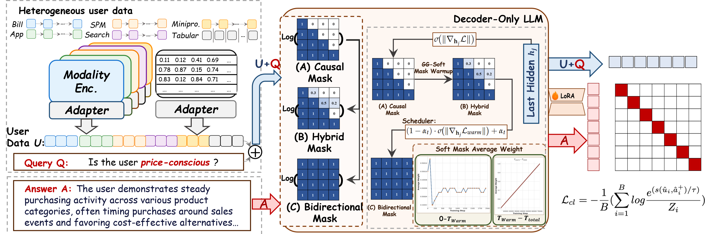

<h2>
<strong>How Do Decoder-Only LLMs Perceive Users? Rethinking Attention Masking for User Representation Learning</strong>
</h2>

<h4>🔍 We introduce <strong>find-embedding</strong> with <strong>GG-SM</strong>: enabling decoder-only LLMs to holistically perceive users via adaptive attention masking 🎯</h4>

<strong>📧 Contact:</strong> <a href="mailto:jhyuan.cs@gmail.com">jhyuan.cs@gmail.com</a> 

---

## 🔥 News
* `2026.02` 🎉 Our paper [*How Do Decoder-Only LLMs Perceive Users?*](https://arxiv.org/abs/2512.01282) has been released on arXiv — check it out now!  
  > 💻 **Code is available at [https://github.com/JhCircle/Deepfind-GGSM](https://github.com/JhCircle/Deepfind-GGSM)**

---

## ⚖️ License
This project is licensed under the **Apache License Version 2.0**. See the [LICENSE](./LICENSE) file for details.