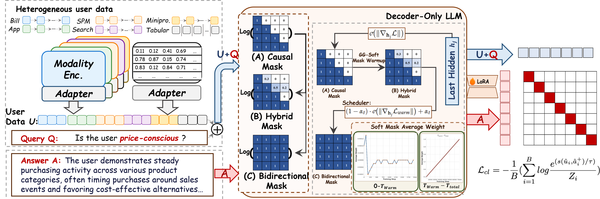
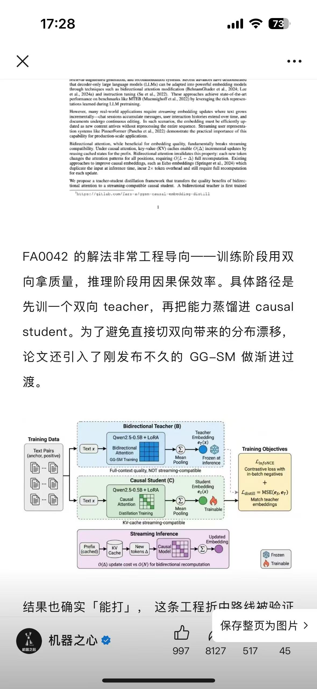

<div align="center">

<h2>
<strong>How Do Decoder-Only LLMs Perceive Users? Rethinking Attention Masking for User Representation Learning</strong>
</h2>

<h4>🔍 We introduce <strong>find-embedding</strong> with <strong>GG-SM</strong>: enabling decoder-only LLMs to holistically perceive users via adaptive attention masking 🎯</h4>

[](https://arxiv.org/abs/2602.10622)

[](https://huggingface.co/papers/2602.10622)
[](https://www.antgroup.com)


</div>

<p align="center"><strong>📧 Contact:</strong> <a href="mailto:jamse_yuan@163.com">jamse_yuan@163.com</a> 
<p align="center">

</p>

---

## 🔥 News
*  `2026.02` 🎉 Our [GGSM](https://arxiv.org/abs/2602.10622) work was highlighted in a report (FA0042) produced by the [FARS](https://analemma.ai/fars) automated research system. A great honor to see our work being followed by research AGI 🤗 — truly witnessing history.
- <details>
  <summary><strong>🖼️ Click to view "Our GG-SM work was followed by research AGI, Amazing! " introducted by <a href="https://mp.weixin.qq.com/s/gT6sN0a0Wir1Yh1JHlieOQ">机器之心</strong></summary>
  <br>
  <div align="center">
    <em>Our [GGSM](https://arxiv.org/abs/2602.10622) work was followed by research AGI, Amazing! </em><br><br>
    
    <br><br>
    <a href="assets/fa0042-机器之心.jpg" target="_blank">📄 Download PNG</a>
  </div>
  <br>
</details>

*  `2026.02` 🎉 Our paper [*How Do Decoder-Only LLMs Perceive Users?*](https://arxiv.org/abs/2602.10622) has been released on arXiv — check it out now!  
  > 💻 **Public code demo available now !**

---

## 📚 Citation
If you find our work useful for your research, please kindly cite our paper as follows:
```python
@article{yuan2026decoder,
  title={How Do Decoder-Only LLMs Perceive Users? Rethinking Attention Masking for User Representation Learning},
  author={Yuan, Jiahao and Xu, Yike and Wen, Jinyong and Wang, Baokun and Chen, Yang and Lin, Xiaotong and Huang, Wuliang and Gao, Ziyi and Fu, Xing and Cheng, Yu and others},
  journal={arXiv preprint arXiv:2602.10622},
  year={2026}
}

@article{yuan2026query,
  title={Query as Anchor: Scenario-Adaptive User Representation via Large Language Model},
  author={Yuan, Jiahao and Xu, Yike and Wen, Jinyong and Wang, Baokun and Gao, Ziyi and Lin, Xiaotong and Liu, Yun and Fu, Xing and Cheng, Yu and Liu, Yongchao and others},
  journal={arXiv preprint arXiv:2602.14492},
  year={2026}
}
```
## ⚖️ License
This project is licensed under the **Apache License Version 2.0**. See the [LICENSE](./LICENSE) file for details.
